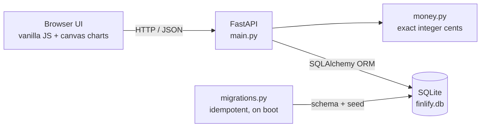

<div align="center">


<br/>

**A local-first personal finance dashboard.** Exact-cent accounting, user-managed
categories, budgets, insights, and a dependency-free canvas UI.
Your data never leaves your machine.

[](https://www.python.org/)
[](https://fastapi.tiangolo.com/)
[](https://www.sqlalchemy.org/)
[](https://www.sqlite.org/)
[](#license)
[](#privacy)

[Features](#features) · [Quick start](#quick-start) · [Architecture](#architecture) · [API](#api-reference) · [Data model](#data-model) · [Privacy](#privacy)

</div>

---

## Overview

Finlify is a single-user finance tracker you run yourself. It keeps a plain SQLite
file on your disk, serves a fast dark dashboard, and does all of its money maths in
**integer cents** so totals never drift. There is no account, no cloud sync, no
analytics, no CDN, and no telemetry. Start it, open the browser, and your ledger is
there.

The whole thing is deliberately small: a few hundred lines of Python, vanilla
JavaScript, and hand drawn `<canvas>` charts. It works offline and installs in seconds.

## Features

| Area | What you get |
| --- | --- |
| **Exact money** | Every amount is stored and summed as integer cents. Floats are used only to render text, never to add up balances. |
| **Dashboard** | Balance, income, expenses, savings rate, this-month figures, average daily spend, and a projected month-end total. |
| **Insights** | Largest expense, top spending category, and the biggest month-over-month jump. |
| **Charts** | Income vs. expense area chart, category donut, budget bars, and a daily spend sparkline — all drawn locally on `<canvas>`. |
| **Categories** | Full create, rename, recolor, archive, and delete. Renaming rewrites history so nothing is orphaned. |
| **Budgets** | Monthly limits per category with `ok` / `warn` / `over` states at 80% and 100%. |
| **Ledger** | Filter by type, category, and text; sort, paginate, edit, and delete entries. |
| **Backup** | One-click JSON export and an idempotent import that never duplicates money. |
| **Zero drift** | Idempotent migrations run on every boot; re-running them is a no-op. |

## Quick start

Requires **Python 3.11 or newer**.

```bash
git clone https://github.com/matkecn/finlify.git
cd finlify

python3 -m venv .venv
source .venv/bin/activate        # Windows: .venv\Scripts\activate

pip install -r requirements.txt
uvicorn main:app --reload
```

Open <http://127.0.0.1:8000>.

On first run Finlify creates `finlify.db` beside the code and seeds a starter set of
income and expense categories. Delete the file to start over.

### Run without a virtual environment

```bash
pip install --user -r requirements.txt
uvicorn main:app --host 127.0.0.1 --port 8000
```

### Apply migrations manually

Migrations run automatically at startup, but you can also run them directly:

```bash
python migrations.py
```

## Configuration

| Variable | Purpose | Default |
| --- | --- | --- |
| `FINLIFY_DATA_DIR` | Directory that holds `finlify.db`. Useful for tests and throwaway instances. | Project root |

```bash
FINLIFY_DATA_DIR=/tmp/finlify-demo uvicorn main:app --port 8001
```

## Architecture

Finlify is three layers and a single file.



- **`main.py`** — page, API routes, validation, analytics, export/import.
- **`models.py`** — the `Transaction`, `Category`, `Budget`, and `AppMeta` ORM models.
- **`money.py`** — decimal to cents conversion with half-up rounding and a hard cap.
- **`migrations.py`** — upgrades the legacy float schema to integer cents and seeds categories.
- **`database.py`** — engine and session factory; honours `FINLIFY_DATA_DIR`.
- **`static/` + `templates/`** — the dashboard, charts, and styles.

## How money is handled

Binary floating point cannot represent `0.10` or `19.99` exactly, and summing such
values drifts over time. Finlify avoids the problem entirely:

1. User input arrives as a decimal (`"19.99"`).
2. It is converted **once** to integer cents with half-up rounding (`1999`).
3. All storage, aggregation, and comparison happens on integers.
4. A float is produced **only** at the edge, for display, alongside the exact
   `*_cents` value so a client can verify totals without reintroducing drift.

Unclassified legacy rows (a `type` that is neither `income` nor `expense`) are
counted in the ledger but excluded from every monetary total, so old or malformed
data can never distort a balance.

## Data model

**`transactions`**

| Column | Type | Notes |
| --- | --- | --- |
| `id` | integer | Primary key |
| `amount_cents` | integer | Exact minor units, never a float |
| `type` | text | `income` or `expense` |
| `category` | text | Category name; text, not a foreign key, so history survives renames |
| `description` | text | Optional, up to 140 characters |
| `date` | date | ISO `YYYY-MM-DD` |

**`categories`**

| Column | Type | Notes |
| --- | --- | --- |
| `id` | integer | Primary key |
| `name` | text | Unique, normalised, up to 40 characters |
| `kind` | text | `income` or `expense` |
| `color` | text | Hex colour used by the charts |
| `is_archived` | boolean | Hidden from pickers without deleting history |
| `sort_order` | integer | User-defined ordering |

**`budgets`**

| Column | Type | Notes |
| --- | --- | --- |
| `id` | integer | Primary key |
| `category` | text | Unique expense category name |
| `limit_cents` | integer | Monthly limit in exact cents; `0` clears tracking |

**`app_meta`** — a small key/value table holding `schema_version` and bookkeeping.

## API reference

Interactive docs are generated by FastAPI at <http://127.0.0.1:8000/docs>.

| Method | Path | Purpose |
| --- | --- | --- |
| `GET` | `/` | The dashboard page |
| `GET` | `/api/health` | Status plus database path and row counts |
| `GET` | `/api/summary` | Full dashboard summary, totals, and insights |
| `GET` | `/api/timeseries?months=6` | Monthly income, expense, and net totals |
| `GET` | `/api/breakdown?months=6&type=expense` | Per-category totals and shares |
| `GET` | `/api/daily?days=30` | Per-day totals for the sparkline |
| `GET` | `/api/transactions` | Filtered, sorted, paginated ledger page |
| `POST` | `/api/transactions` | Create a transaction |
| `PUT` | `/api/transactions/{id}` | Replace a transaction |
| `DELETE` | `/api/transactions/{id}` | Delete a transaction |
| `GET` | `/api/categories?include_archived=false` | List categories |
| `POST` | `/api/categories` | Create a category |
| `PUT` | `/api/categories/{id}` | Partial update, including rename with history rewrite |
| `DELETE` | `/api/categories/{id}` | Delete a category (refused if it is in use) |
| `GET` | `/api/budgets` | Budgets with current-month spend |
| `PUT` | `/api/budgets/{category}` | Create or update a monthly limit |
| `DELETE` | `/api/budgets/{category}` | Remove a budget |
| `GET` | `/api/export` | Download a versioned JSON backup |
| `POST` | `/api/import` | Restore or merge a backup (idempotent) |
| `GET` | `/dashboard` | Legacy totals payload for older bookmarks |

### Example

```bash
curl -X POST http://127.0.0.1:8000/api/transactions \
  -H 'Content-Type: application/json' \
  -d '{"amount": "19.99", "type": "expense", "category": "Groceries", "date": "2026-09-30"}'
```

```json
{
  "id": 1,
  "amount": 19.99,
  "amount_cents": 1999,
  "type": "expense",
  "category": "Groceries",
  "description": null,
  "date": "2026-09-30",
  "classified": true
}
```

## Project structure

```
finlify/
├── main.py              # FastAPI app: routes, validation, analytics
├── models.py            # SQLAlchemy models (integer-cent columns)
├── money.py             # Decimal <-> cents with half-up rounding
├── migrations.py        # Idempotent migrations + default categories
├── database.py          # Engine, sessions, FINLIFY_DATA_DIR support
├── requirements.txt
├── templates/
│   └── index.html       # Single-page dashboard
├── static/
│   ├── app.js           # Dashboard controller
│   ├── charts.js        # Canvas chart engine
│   ├── style.css        # Theme
│   └── favicon.svg
└── assets/              # Logo, icon, and banner used in this README
```

## Privacy

- No network calls at runtime. The page loads only local assets; the charts are
  drawn in the browser.
- No accounts, no analytics, no telemetry, no third-party services.
- Your ledger lives in a single SQLite file on your disk, and the database is
  excluded from version control by `.gitignore`.

Run it on `127.0.0.1` and it is reachable only from your machine.

## Backups and restore

- **Export:** click *Export* in the dashboard, or `GET /api/export`, to download
  `finlify-backup-YYYY-MM-DD.json` with every transaction, category, and budget.
- **Import:** click *Import*, or `POST /api/import`. Merging is the default and is
  idempotent — a transaction that already exists (same date, type, category,
  amount, and description) is skipped, so importing the same file twice never
  double-counts. Send `{"replace": true, ...}` to restore instead of merge.

## License

Released under the [MIT License](LICENSE).
